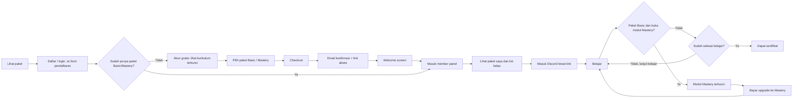
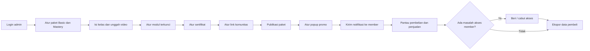

# Alur Pengguna: Platform Kelas Flow Trader

Dijual per paket, bukan per kelas. Hanya ada 2 paket: Basic dan Mastery.

## Diagram alur member (bercabang)

## Skenario 1: user belum punya paket

User bisa daftar dan login, lalu melihat daftar materi dan kurikulum dengan status terkunci. Klik materi menampilkan prompt upgrade ke Basic atau Mastery. Akun gratis juga tidak menampilkan link Discord. Akun gratis dibuat otomatis saat pendaftaran, tanpa persetujuan admin.

| No | Langkah | Fitur terkait |
| --- | --- | --- |
| 1 | Membuka halaman paket dan melihat detail Basic dan Mastery | Halaman paket dan detailnya |
| 2 | Daftar atau login. Daftar manual mengisi nama, email, password, no HP, akun Discord. Daftar dengan Google cukup nama, no HP, akun Discord | Daftar dan masuk platform, Form pendaftaran, Free Plan |
| 3 | Melihat kurikulum yang terkunci, klik dan diminta upgrade ke Basic atau Mastery. Link Discord tidak ditampilkan | Free Plan, Pembatasan akses member panel |
| 4 | Checkout dan membayar | Checkout Payment Gateway (DOKU) |
| 5 | Menerima email berisi konfirmasi pembayaran dan link akses platform (langsung ke platform) | Email konfirmasi pembayaran + link akses platform |
| 6 | Membuka link dan melihat welcome screen sebelum masuk member panel | Welcome screen setelah membeli paket |

## Skenario 2: user sudah punya paket

| No | Langkah | Fitur terkait |
| --- | --- | --- |
| 1 | Masuk ke member panel | Pembatasan akses member panel |
| 2 | Melihat paket saya dan list kelas di dalamnya | Paket saya dan riwayat pembelian |
| 3 | Masuk ke Discord lewat link, sesuai masa berlaku paket | Link join Discord, Notifikasi Platform |
| 4 | Belajar: menonton video yang terlindungi dan lanjut dari video terakhir | Halaman utama pembelajaran, Streaming Management, Temporary URL Video, Watermark secara dinamis, Video terakhir diakses |
| 5 | (Paket Basic) Modul Mastery diblur atau dikunci. Perlu bayar untuk membuka | Modul terkunci (blur/lock), Upgrade: paket Basic → paket Mastery |
| 6 | Setelah seluruh materi paket selesai dipelajari, member mendapat sertifikat. Selama belum selesai, member lanjut belajar | Sertifikat |

## Alur owner (admin Flow Trader)

**Persiapan (sekali di awal)**

| No | Langkah | Fitur terkait |
| --- | --- | --- |
| 1 | Login ke panel admin | Daftar dan masuk platform |
| 2 | Mengatur paket Basic dan Mastery: deskripsi dan harga | Kelola paket, kelas, video, dan harga |
| 3 | Mengisi kelas dan bab, lalu mengunggah video | Kelola paket, kelas, video, dan harga |
| 4 | Menentukan modul Mastery yang terkunci untuk paket Basic | Modul terkunci (blur/lock) untuk paket Basic |
| 5 | Mengatur template sertifikat | Kelola template sertifikat |
| 6 | Mengisi link komunitas Discord | Kelola link komunitas |
| 7 | Mempublikasikan paket | Halaman paket dan detailnya |

**Operasional (berulang)**

| No | Langkah | Fitur terkait |
| --- | --- | --- |
| 8 | (Opsional) Mengatur popup promo untuk member | Popup promo |
| 9 | Mengirim notifikasi ke member | Kelola notifikasi platform |
| 10 | Memantau pembelian dan penjualan | Daftar member dan pembelian, Ringkasan penjualan |
| 11 | Jika ada masalah akses, memberi atau mencabut akses member | Beri/cabut akses |
| 12 | Mengunduh data pembeli | Ekspor CSV/Excel |
